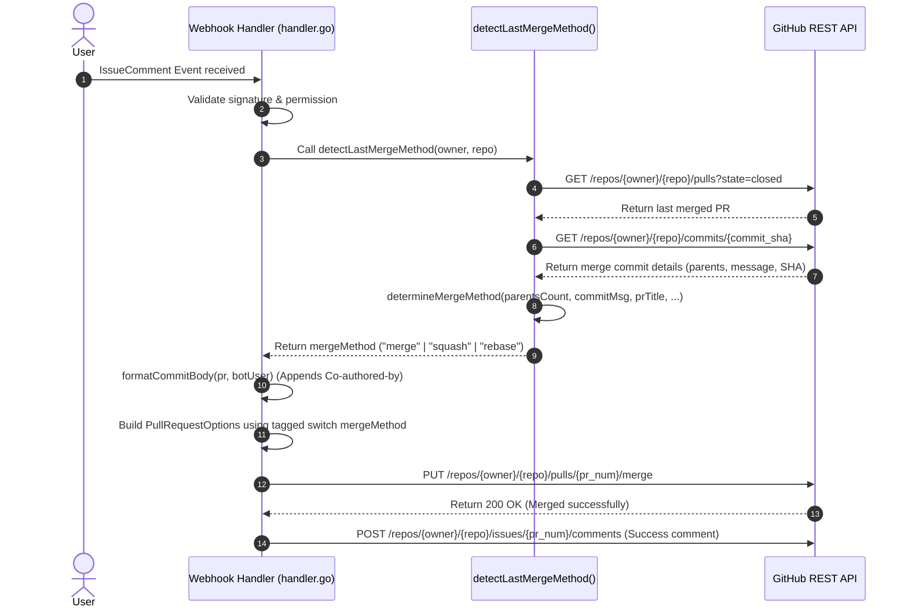

# Developer & AI Agent Rules for DaVinci Bot

This document defines non-negotiable rules, code patterns, technical mechanisms, and Git/GitHub API mechanics for the DaVinci GitHub Bot codebase (`handler.go`, `main.go`, `main_test.go`). All AI coding agents (including DeepSeek, Gemini, GPT, Claude, etc.) **MUST** adhere strictly to these rules without altering the contract.

---

## 1. Pull Request Merge Strategy & Title Formatting Rules

> [!IMPORTANT]
> **ALWAYS use a tagged `switch mergeMethod` to format `CommitTitle` in `github.PullRequestOptions`**.

### Required Code Pattern (`handler.go` - Line ~433)
```go
opts := &github.PullRequestOptions{
    MergeMethod: mergeMethod,
    SHA:         pr.GetHead().GetSHA(),
}
switch mergeMethod {
case "squash":
    opts.CommitTitle = fmt.Sprintf("%s (#%d)", pr.GetTitle(), prNum)
case "merge":
    opts.CommitTitle = pr.GetTitle()
}
```

### Exact Behavior & GitHub API Payload Matrix per Strategy

| `mergeMethod` | `opts.CommitTitle` Value | GitHub API Payload Result | Commit Message in Git History | Git Parent Count |
|---|---|---|---|---|
| **`merge`** | `pr.GetTitle()` | `"commit_title": "PR Title"` | `pr.GetTitle()` *(Clean title; overrides GitHub default `Merge pull request #X from owner/branch`)* | **2 parents** |
| **`squash`** | `fmt.Sprintf("%s (#%d)", pr.GetTitle(), prNum)` | `"commit_title": "PR Title (#PR_NUM)"` | `PR Title (#PR_NUM)` *(Preserves PR link attribution)* | **1 parent** |
| **`rebase`** | `""` (empty string) | Omitted from payload (`omitempty`) | Preserves original commit titles from PR branch | **1 parent** per commit |

---

> [!CAUTION]
> ### ⛔ STRICT DO NOTS FOR AI AGENTS (DEEPSEEK, GEMINI, GPT, CLAUDE):
> 1. **DO NOT leave `opts.CommitTitle` empty (`""`) for `"merge"`**:
>    - **Why?** Leaving `CommitTitle` empty forces GitHub REST API to generate `"Merge pull request #X from owner/branch"`. The repository owner strictly rejects this default string format.
> 2. **DO NOT replace `switch mergeMethod` with `if mergeMethod == "squash" ... else if mergeMethod == "merge"`**:
>    - **Why?** Comparing a single variable (`mergeMethod`) against string literals using `if / else-if` triggers Go linter failures (`gocritic: taggedSwitch`).
> 3. **DO NOT remove the `(#PR_NUMBER)` suffix for `"squash"`**:
>    - **Why?** Removing `(#PR_NUMBER)` breaks GitHub issue/PR auto-linking and breaks squash commit recognition during history auto-detection.
> 4. **DO NOT change `opts.CommitTitle` for `"rebase"`**:
>    - **Why?** Rebase applies commits individually. Overriding `CommitTitle` on rebase overwrites all commit messages with a single PR title.

---

## 2. Full Execution Lifecycle: How a Merge Command Works

When a user posts a comment on a PR (e.g. `/merge` or `@davinci merge`), the following sequence executes inside `handler.go`:



---

## 3. Merge Method Auto-Detection Mechanics (`detectLastMergeMethod` & `determineMergeMethod`)

### Why Auto-Detection Exists
When the bot is commanded to merge a PR without an explicit strategy parameter, it inspects the repository history to discover the project's active merge strategy (`merge`, `squash`, or `rebase`) and reuses that same strategy.

### Detailed Step-by-Step Logic in `determineMergeMethod()`

```go
func determineMergeMethod(parentsCount int, commitMsg, prTitle string, prNum, prCommitsCount int, commitSHA, headSHA string) string {
    // Step 1: Git Parent Count Check
    if parentsCount == 2 {
        return "merge"
    }

    // Step 2: Squash Commit Title Pattern Matching
    squashPattern := fmt.Sprintf("(#%d)", prNum)
    if strings.Contains(commitMsg, squashPattern) {
        return "squash"
    }
    if prTitle != "" && strings.Contains(commitMsg, prTitle) {
        return "squash"
    }

    // Step 3: Commit SHA Mutation Check
    if prCommitsCount >= 1 && commitSHA != "" && headSHA != "" && commitSHA != headSHA {
        return "squash"
    }

    // Step 4: Rebase / Default Fallback
    return "rebase"
}
```

### Deep Dive: How Each Step Works Under the Hood

#### 🔹 Step 1: Git Parent Count (`parentsCount == 2`)
- **Git Internal Mechanism**: Standard Git merge commits create a graph node with **exactly 2 parent commits**:
  - `Parent 1`: The tip of the target branch (`main`).
  - `Parent 2`: The tip of the feature branch being merged.
- **Why this check is Step 1**: Regardless of what text is in `commitMsg` (whether GitHub default `Merge pull request #12...` or custom clean PR title `pr.GetTitle()`), Git ALWAYS records `parentsCount == 2` in the commit object.
- **Key Technical Guarantee**: Because `parentsCount == 2` is checked first, setting `opts.CommitTitle = pr.GetTitle()` for standard merges **does NOT break auto-detection**.

#### 🔹 Step 2: Squash Commit Title Pattern Matching (`parentsCount == 1`)
- **Git Internal Mechanism**: A squash merge compresses all commits from a PR into a single commit on `main`. The resulting commit has only **1 parent commit** (`parentsCount == 1`).
- **Pattern Check**: The bot checks if `commitMsg` contains `(#PR_NUMBER)` or the `prTitle`. Since squash merges produce titles like `feat: add feature (#12)`, matching `(#12)` or `prTitle` identifies it as `"squash"`.

#### 🔹 Step 3: Commit SHA Mutation Check (`commitSHA != headSHA`)
- **Git Internal Mechanism**: When GitHub squashes a PR, it creates a brand new commit on `main` with a new SHA. Therefore, the merged commit's SHA (`commitSHA`) differs from the PR branch head SHA (`headSHA`).
- **Why this check exists**: Even if a squash commit title was customized and lacked `(#PR_NUMBER)`, `commitSHA != headSHA` reliably identifies the commit as a squash merge.

#### 🔹 Step 4: Rebase / Default Fallback
- **Git Internal Mechanism**: A rebase applies commits directly onto `main` without creating a merge commit. For single-commit PRs, `commitSHA == headSHA`.
- **Fallback**: If `parentsCount == 1` and `commitSHA == headSHA`, returns `"rebase"`. If no merged PR history exists in the repository, defaults to `"squash"`.

---

## 4. Co-authored-by Attribution & Bot User ID

> [!IMPORTANT]
> **Do not use the App ID as the Git user ID in the `Co-authored-by` email footer.**

### The Bot Identity Architecture (`s.getBotUser()`)
- **App ID vs Database User ID**:
  - `s.appID` (e.g., `123456`): The ID used to authenticate the GitHub App client via JWT.
  - `botUser.ID` (e.g., `120938290`): The actual GitHub database User ID of the bot account (`da-vinci-bot[bot]`).
- **Official Bot Email Format**:
  `{BOT_USER_ID}+{BOT_LOGIN}@users.noreply.github.com`
  *(Example: `120938290+da-vinci-bot[bot]@users.noreply.github.com`)*
- **Why User ID matters for Git log rendering**:
  - GitHub maps `Co-authored-by` commit footers by parsing the `{id}+{login}` pattern.
  - If an AI agent accidentally uses `s.appID` instead of `botUser.ID`, GitHub fails to map the email to the user account, displaying a **grey, unlinked Octocat avatar** in commit history instead of the bot's proper profile icon.

---

## 5. Verification & Testing Requirements

Whenever modifying merge handlers, webhook logic, or title formatting:

1. **Unit Tests (`main_test.go`)**:
   - `TestDetermineMergeMethod`: Verifies merge strategy detection (including standard merges with clean custom PR titles).
   - `TestPullRequestOptionsCommitTitle`: Verifies `opts.CommitTitle` output across `merge`, `squash`, and `rebase`.
   - `TestFormatCommitBody`: Verifies `Co-authored-by` formatting with user & bot IDs.

2. **Command Verification**:
   - Run `go test -v ./...` (must report `PASS` for all test suites).
   - Run `golangci-lint run` (must pass with 0 errors and 0 warnings).
